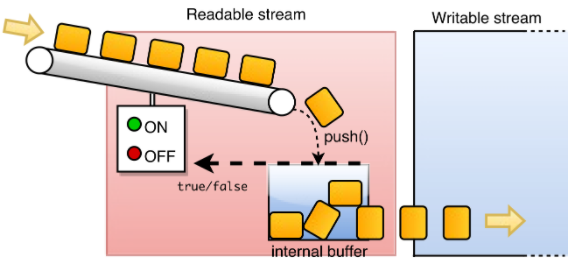
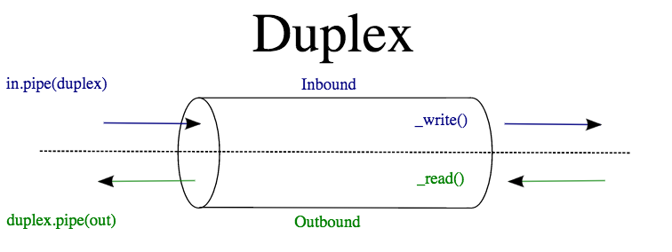
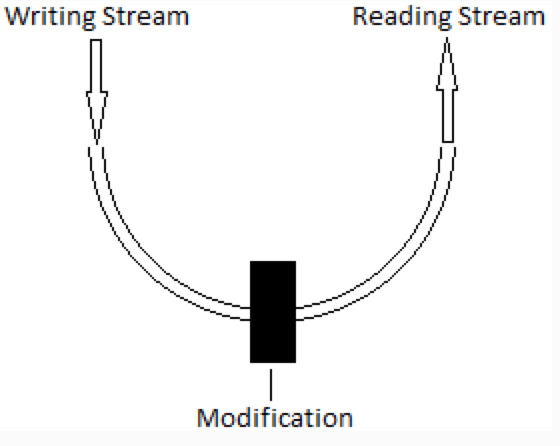

# Event Emitter & Streams

## The observer (pub/sub) pattern

The *observer pattern* is a software design pattern in which objects ('subjects') can notify arbitrary numbers of other objects ('observers') of events or changes of state.

Unlike callbacks, where a single 'listener' is called on completion of a specific task, the observer pattern allows for a *one-to-many* relationship between objects - in other words, a subject can notify several observers when its state changes.

Subjects and observers are also known as *publishers* and *subscribers*, so the observer pattern is also known as the *publish/subscribe* (or *pub/sub*) pattern.

The pattern is mainly used within *event handling* systems, in which a single event might trigger an arbitrary number of responses from 'interested' objects.

The observer pattern can offer huge performance gains over alternative implementations - for example, compared with iterating over every possible dependent object to determine whether it needs to be affected by a state change.

Publish/subscribe also helps *decouple* systems within your software in order to maintain the separation of concerns - or at least it can help to make them *less strongly* coupled.

The observer pattern is one of the fundamental patterns underlying the *Model-View-Controller* architecture, which is ubiquitous in everything from game design to web development. (For example, one of Angular's key selling points is that it provides an MVC framework for web development.)

As a result of the observer pattern's utility and popularity, it has been implemented in several libraries (including the core libraries of Java and Node), and even coded in as a fundamental feature of some languages (such as the ```event``` keyword in C#).

In Node, the observer pattern is usually implemented using the ```events``` module and the ```EventEmitter``` class.

### Examples

Imagine you're working on a website that allows users to log in to gain access to emails, social media, recent news, and so on.

Each of the separate systems providing those functions is interested in whether the user has logged in, but hardcoding calls to those systems into your user login code will result in tightly coupled systems with overlapping concerns.

The observer pattern prevents your login code from needing to explicitly call each system that has an interest in it. Instead, the login code can simply emit a single login event; any interested systems can then add their own event listeners that can respond to the login event appropriately.

This has the added bonus of making it easier to add additional modules as your software expands. Additional systems can simply add their own listener functions to respond to the login event, without any modifications required to the underlying login code.

## EventEmitters and event listeners

Node is more than just a way to use JS outside the browser. It also brings with it an asynchronous style of programming based around events.

We are already familiar with events, like in the following example:

```javascript
document.getElementById('btn').addEventListener('click', function(e) {
  console.log('omg stop poking me!');
});
```

With this bit of code we listen out for a 'click' event and register a function to call whenever we receive a click event.

Node takes this concept and generalises it so that you can listen for and emit all kinds of custom events, not just user input.

The benefit of doing this is that we can write code that is loosely-coupled and asynchronous by default. By communicating primarily with events, our functions and modules don't need to worry about how other parts of code are implemented - they just need to agree on what kind of events are fired and when.

### Emitting events

In node all objects that can emit and listen to events inherit from the `EventEmitter` class. Node provides a few utility functions so that you can merge the relevant methods and properties into objects that you define yourself, but to keep things simple we'll show an example below that just creates a new `EventEmitter` object:

```javascript
var EventEmitter = require('events').EventEmitter; // This is the EventEmitter class.

var emitter = new EventEmitter(); // Create an object 

var remonstrate = function() {
  console.log('Shut the door, it\'s cold!');
};

emitter.on('doorOpen', remonstrate); // Just like with addEventListener, we name the event to listen for and register a function
emitter.emit('doorOpen'); // Fire off an event
```
This code will print a plea to shut the door.

By creating an `EventEmitter` object (or we could have created an object that inherits from it), we gain the `on` and `emit` methods that allow us to handle events. `on` takes two arguments: the name of the event to listen out for (as a string) and a function to call whenever the event happens. When we want to fire off an event we just tell the object to `emit` the event.

To link back to the discussion above, we can see that `on` subscribes its object to events and `emit` publishes an event.

In this example the same object emits and handles the event, but this is not a requirement. We can also send data with our event in the form of an argument.

Let's think back to the Node Girls CMS workshop for a more practical example. Whenever a blog post is submitted, we want it to save it to the website's list of posts. In this example, assume that `app` and `blogList` are both objects that from `EventEmitter`:

```javascript
var querystring = require('querystring');

var handler = function(request, response) {
  if(req.url === '/submit-post' && req.method === 'POST') {
    var body = '';

    request.on('data', function(chunk) { // <-- OMG event listener!
      body += chunk;
    });

    request.on('end', function() { // <-- and again!!
      var blogPost = querystring.parse(body);
      app.emit('newPost', blogPost);
    });
  }
};

/* TOTALLY SOMEWHERE ELSE IN YOUR CODE */

blogList.on('newPost', function(post) {
  listOfPosts.push(post);
});
```

The key point to note here is that `blogList` doesn't know anything about where the event came from. All is it cares about is whether a 'newPost' event has been dispatched. In this example the 'newPost' event is fired as part of the HTTP request handling but it could easily come as part of loading a backup from a file on disk or from elsewhere. We could completely replace how new posts are submitted and the listener would not need to change as long as we continue to provide it with a valid 'post' argument.

As you can see in the example above, the standard `request` and `response` objects we know and love also inherit from `EventEmitter`, because we can see that they have the `on` method!!

Using events means that we can easily extend our code without having to make changes to existing code. Let's say we want to automatically generate a new HTML page for every blog post that gets submitted. All we'd need to do is make sure that the page generation code includes a listener for our 'newPost' event:

```javascript
pageGenerator.on('newPost', function(post) {
  createNewPageFor(post);
});
```

### Inheriting from EventEmitter

Whenever you see an object using methods like `on` that means it's using the functionality provided by `EventEmitter`. In these examples we just created new `EventEmitter` objects to get access to these methods. Of course, in real code you'd probably define your own objects for different bits of functionality. It would be good if we could pull the `EventEmitter`'s functionality into our own objects.

Hooray, we can! The syntax is a little funky so we haven't covered it in this README but [this article](https://code.tutsplus.com/tutorials/using-nodes-event-module--net-35941) covers it clearly.

## Streams and the stream module



### What are streams?

- Streams are unix pipes that let you easily read data from a source and pipe it to a destination.
- They behave similarly to UNIX pipes.
- Streams are instances of EventEmitter.
- Where Event Emitter allows callbacks of data, streams use Buffer objects to transfer data.
- Streams can accept various types of data, including text and binary data.

### What types of streams are there?

- <b>Readable</b> (i.e. read from source, e.g. request in http).
  After initialising, a readable stream triggers a 'data' event when chunks of data are received, this event relinquishes ownership of that chunk of data. Eventually, an 'end' event is fired, which signals the end of the stream.
  ```javascript
  var fs = require('fs'); //fileSystem module
  var readableStream = fs.createReadStream('file.txt'); //create read buffer
  var data = '';

  readableStream.on('data', function(chunk) {
      data+=chunk; // add chunk of data when chunk of data is ready
  });

  readableStream.on('end', function() {
      console.log(data); //when stream has finished reading the data.
  });
  ```

- <b>Writable</b> (write to destination, e.g. response in http).
  Takes the writable chunks of data and writes it to the destination. Mostly works in unison with readable streams. Returns a boolean after operation indicating whether it was successful or not.
  ```javascript
  var fs = require('fs'); // Filesystem
  var readableStream = fs.createReadStream('file1.txt'); // Creating read stream from file1
  var writableStream = fs.createWriteStream('file2.txt'); // Creating write stream for file2
  readableStream.setEncoding('utf8'); // Ensuring buffer encoding is utf-8 (which is 256 possible characters).

  readableStream.on('data', function(chunk) {
      writableStream.write(chunk); // writing contents of file1 => file2
  });
  ```

- <b>Duplex</b> (can both read & write).
  
  An example of a duplex stream would be a socket, which can be used to allow communication between a client and server.
  To create a custom duplex stream, create a class which inherits from the Duplex abstract class, implement the write and read methods. Duplex streams inherit from transform streams...

- <b>Transform</b> (write to, modify, and then read from).
  
  Transform streams allow modification/transformation of the data flowing to and from it:
  ```javascript
  var Transform = require('stream').Transform;  // pulls in transform module
  var inherits = require('util').inherits; // deprecated. Use 'extends'

  module.exports = JSONEncode;

  function JSONEncode(options) {  
    if ( ! (this instanceof JSONEncode))
      return new JSONEncode(options);

    if (! options) options = {};
    options.objectMode = true;
    Transform.call(this, options); // transforming data from JSON data
  }

  inherits(JSONEncode, Transform);

  JSONEncode.prototype._transform = function _transform(obj, encoding, callback) {  
    try {
      obj = JSON.stringify(obj);
    } catch(err) {
      return callback(err);
    }

    this.push(obj);
    callback();
  };
  ```

As streams read from a Buffer object, you can set the encoding if need be;

```javascript
readableStream.setEncoding('utf8');
```

### What are pipes?

What's an easy way of connecting a readable stream to a writable stream? Pipes! In UNIX piping, you can do the following;

```
$~ cat file1.txt | nano file2.txt
```
This shows how you can take the outputted contents of file1.txt, and pipe it into the contents of file2.txt.
This shows that you can take the output of the cat command and then pass it as an input to the nano command.

In node, similar results can be achieved. Instead of calling the 'data' event on the readable stream and returning the result on 'end' to a writeable stream, you can simply connect the readable stream to the writable stream via the .pipe method;

```javascript
var fs = require('fs'); // Magic
var readableStream = fs.createReadStream('file1.txt'); // Super Magic
var writableStream = fs.createWriteStream('file2.txt'); // Super Magic

readableStream.pipe(writableStream); //Wizardry
```

### Command Line Examples

- The following example shows how to list files in the current directory (ls), retain only the lines of ls output containing the string "key" (grep), and view the result in a scrolling page (less);
```
$~ ls -l | grep key | less
```
- The following example shows how to inspect all system processes then retain only the processes that contain 'chrome'.
```
$~ ps aux | grep chrome
```

## Example
```javascript
var http = require('http');

http.createServer(function(request, response) {
  var headers = request.headers;
  var method = request.method;
  var url = request.url;
  var   body = [];
  request.on('error', function(err) {
        console.error(err);
       }).on('data',  function(chunk) {
        body.push(chunk);
       }).on('end',  function() {
        body = Buffer.concat(body).toString();
        // At this point, we have the headers, method, url and body, and can now
        // do whatever we need to in order to respond to this request.
      });
}).listen(8080); // Activates this server, listening on port 8080.

```

## (All)

These concepts can get quite abstract. What are some common examples of EventEmitters and Streams in node we're likely to come across as a group? Can you think of any small program ideas or code samples you can use to demonstrate and talk through these concepts with the group?

## Resources
- [Node.js: Events and EventEmitter](https://www.sitepoint.com/nodejs-events-and-eventemitter/)
- [The observer pattern](https://www.packtpub.com/mapt/book/web-development/9781783287314/1/ch01lvl1sec12/the-observer-pattern)
- [Publish-subscribe pattern](https://en.wikipedia.org/wiki/Publish–subscribe_pattern)
- [Observer pattern](https://en.wikipedia.org/wiki/Observer_pattern)
- [Using an event emitter](http://blog.yld.io/2015/12/15/using-an-event-emitter)
